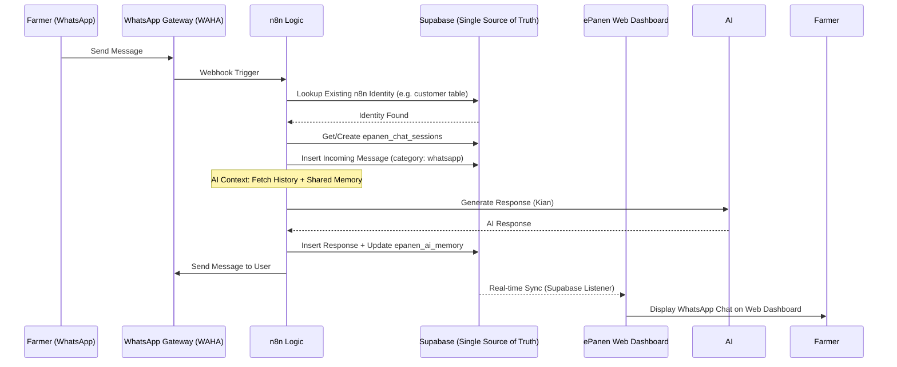

# ePanen: Web-n8n-WhatsApp Integration Plan (Technical Deep-Dive)

This document outlines the exact technical logic for synchronizing the ePanen Web Platform with the n8n-powered WhatsApp chatbot.

## 1. Core Synchronization Architecture

## 2. Shared Database Logic

### A. Identification Logic (Non-Invasive Relation)
- **Concept**: **n8n stays exactly as it is.** It still treats each WhatsApp number as a single permanent session/identity in its own `customer` (or similar) table.
- **The Relation**: We create a mapping table in ePanen: `epanen_user_whatsapp_links`.
  - `user_id`: Links to `epanen_users.id` (Web Account)
  - `whatsapp_identity`: Links to n8n's identifier (Phone or Customer ID)
- **Unified Sync**: 
  1. When n8n receives a message, it updates its own tables.
  2. The ePanen Web app uses the **Relationship Map** to pull messages from *all* linked WhatsApp identities into the user's dashboard.
  3. This allows a user to have **Multiple WhatsApps** while n8n remains simple and unmodified.

### B. Message Synchronization (`epanen_chat_messages`)
To ensure the Web and WhatsApp chats don't conflict, we use a `category` discriminator:
| Column | Value (WhatsApp) | Value (Web) |
|--------|------------------|-------------|
| `user_id` | Linked ID | Linked ID |
| `role` | `user` / `assistant` | `user` / `assistant` |
| `category` | `whatsapp` | `general` / `budidaya` / etc. |
| `session_id` | UUID (Permanent WA Sync) | UUID (Web Session) |

### C. Persistent AI Context (`epanen_ai_memory`)
Kian uses a "Key-Value" memory system stored in `epanen_ai_memory`.
- **Sync Logic**: 
  - If a Farmer discusses **"Melon Pests"** on WhatsApp, n8n writes: `{ key: 'pembahasan_hama', value: 'Melon' }`.
  - When the same Farmer logins to the Web, the `chatService` reads this key.
  - Kian (on Web) says: *"Halo! Melanjutkan diskusi kita di WhatsApp tadi tentang hama Melon..."*

## 3. n8n Workflow Detail (Logic Nodes)

1.  **Trigger (WAHA)**: Receives Raw JSON from WhatsApp.
2.  **User Resolver**: n8n queries its own `customer` (or similar) table as always. n8n remains unaware of the Web account.
3.  **Context Aggregator**:
    - Fetch last 5 messages from `epanen_chat_messages` where `user_id = $1`.
    - Fetch relevant entries from `epanen_ai_memory` (Context Persistence).
4.  **AI Agent (Kian)**: Uses OpenRouter with the combined context.
5.  **Data Sink (Supabase Node)**:
    - Save User Message.
    - Save AI Response.
    - Update Memory Keys.
6.  **Responder (WAHA Node)**: Sends the text back to WhatsApp.

## 4. Edge Cases & Safety
- **Unregistered Phone**: If user chats from a new number, n8n can either create a new identity or the user can link it manually via the Web Portal by verifying the OTP.
- **Session Conflicts**: WhatsApp uses a single permanent session per user, while the Web can have multiple. The logic will prioritize the **latest** memory key regardless of the platform.

## 5. Admin Control (Kian Office)
- **WhatsApp Manager**: A new section in the Admin Dashboard for:
    - **Inventory**: See all WhatsApp identities currently active in n8n.
    - **Relationship Management**: Admins can manually link an "Unknown" WhatsApp phone to an existing ePanen Web user.
    - **Unified Timeline**: Admins can view a single, chronological stream of both Web and WhatsApp chats for any user. Icons will indicate the source of each message.
    - **History Viewing**: Admins can view the specific WhatsApp conversation stream for any linked identity from the central dashboard.

---
*Updated on: 2026-02-04*
