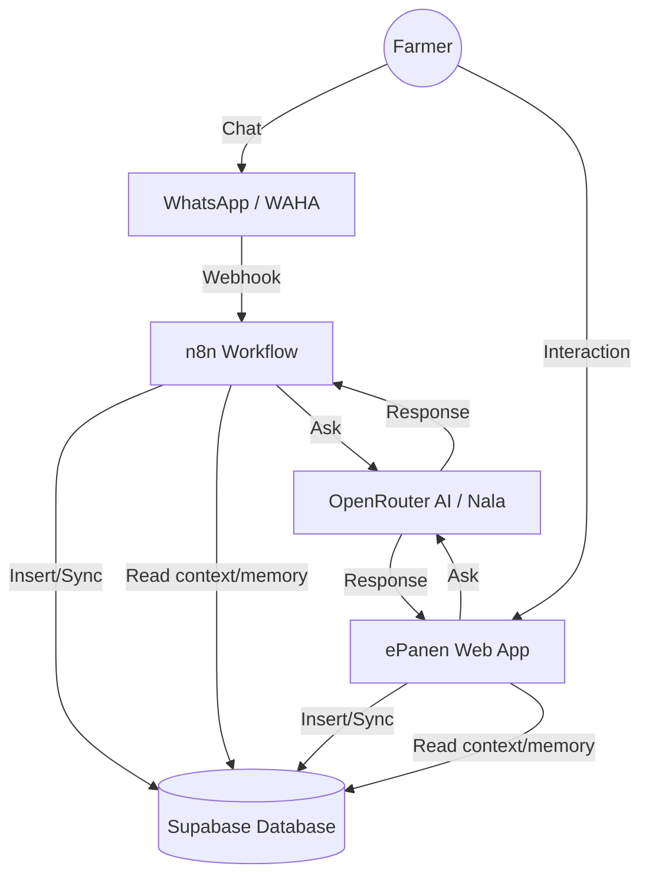

# ePanen: Web-n8n-WhatsApp Integration Plan

This document outlines the technical logic for synchronizing the ePanen Web Application with the n8n-powered WhatsApp chatbot using Supabase as the shared backbone.

## 1. Integration Architecture

## 2. Shared Identity (Single Source of Truth)
- **Primary Key**: Users are identified by their **Phone Number** (`epanen_users.phone`).
- **Linking**: When a message arrives via WhatsApp (WAHA), n8n queries `epanen_users` to find the matching `user_id`.
- **New Users**: If a phone number is unknown, n8n can create a placeholder user profile that the user can later claim on the Web.

## 3. Communication Synchronization
- **Table**: `epanen_chat_messages`.
- **Flow**:
    - **Incoming WhatsApp**: n8n receives the message -> Stores in `epanen_chat_messages` with `category: 'whatsapp'`.
    - **Nala's Response**: n8n sends context to AI -> Receives response -> Stores in `epanen_chat_messages` -> Sends back to WA.
- **Web Visibility**: The Web frontend queries this table, allowing the Farmer to see their WhatsApp conversation history in their Web dashboard.

## 4. Persistent AI Context (Memory)
- **Table**: `epanen_ai_memory`.
- **Logic**: Nala stores insights (e.g., "User is currently planting Melon") in this table.
- **Cross-Platform**: Because both n8n and the Web Backend read from this table, Nala recognizes the user's current situation regardless of whether they are chatting on WhatsApp or the Web Portal.

## 5. Admin Integration (Nala Office)
- **Live Monitoring**: The Admin "Chat Logs" will display a unified stream of both Web and WhatsApp interactions.
- **Outreach**: Admins can trigger n8n workflows from the Web Dashboard to send broadcast alerts (e.g., price drops, weather warnings) directly to farmers' WhatsApp.

---
*Created on: 2026-02-04*
